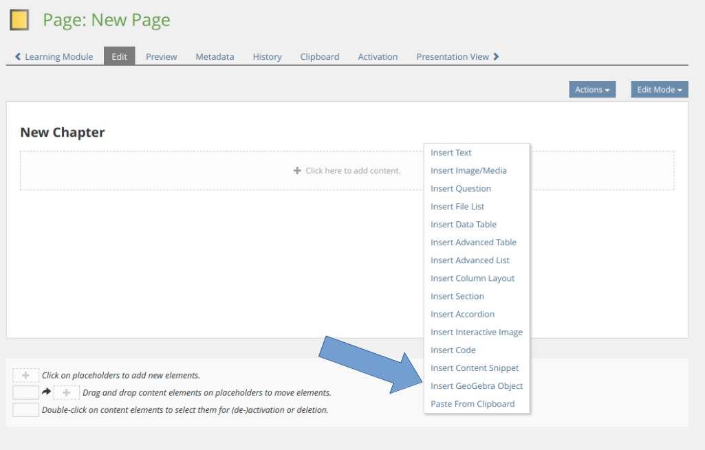
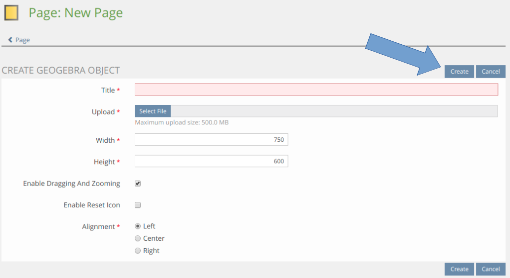
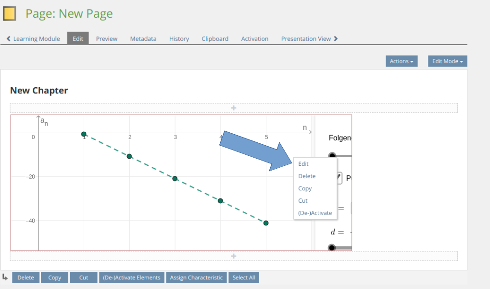
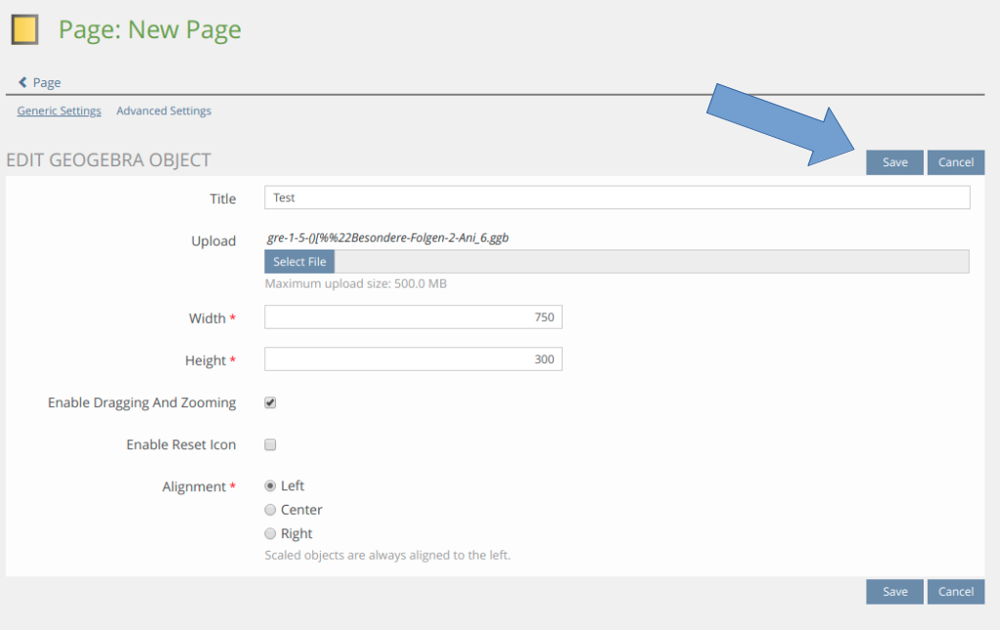
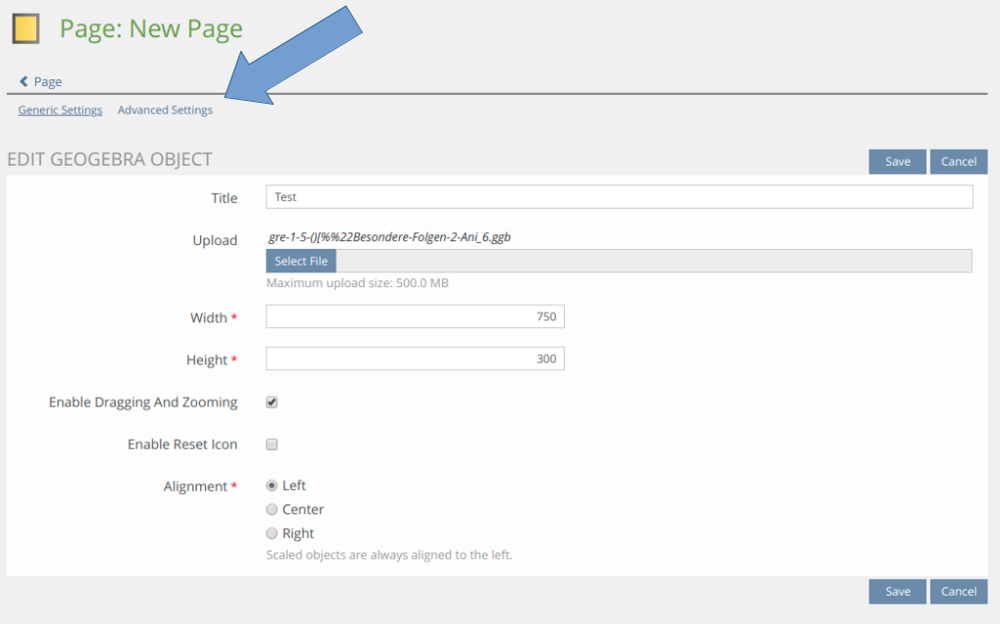
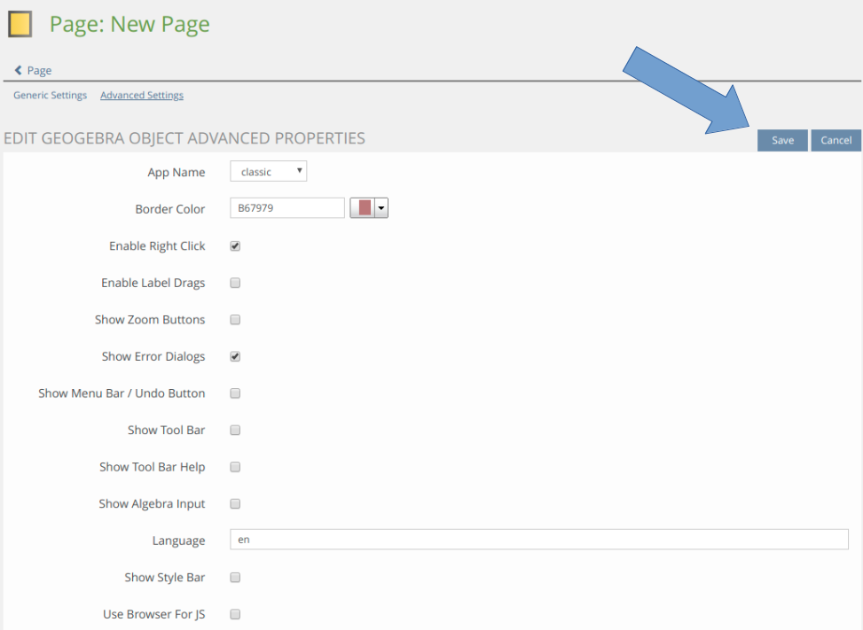
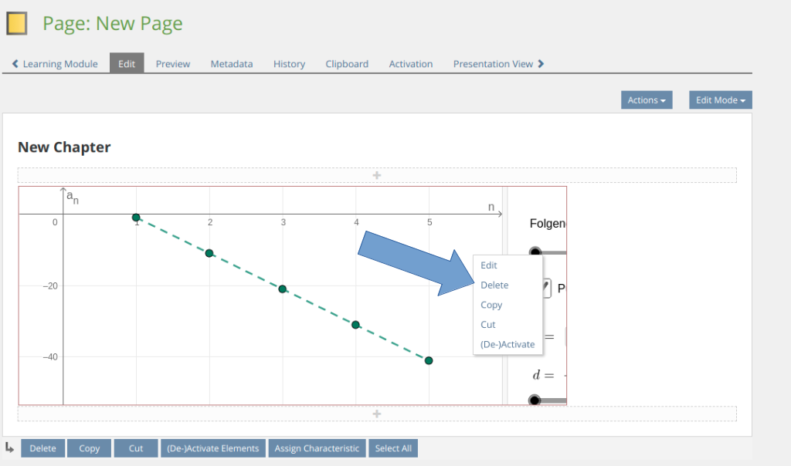
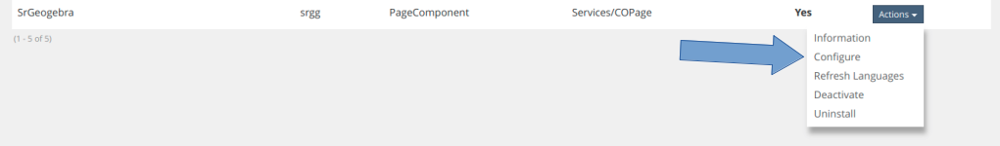
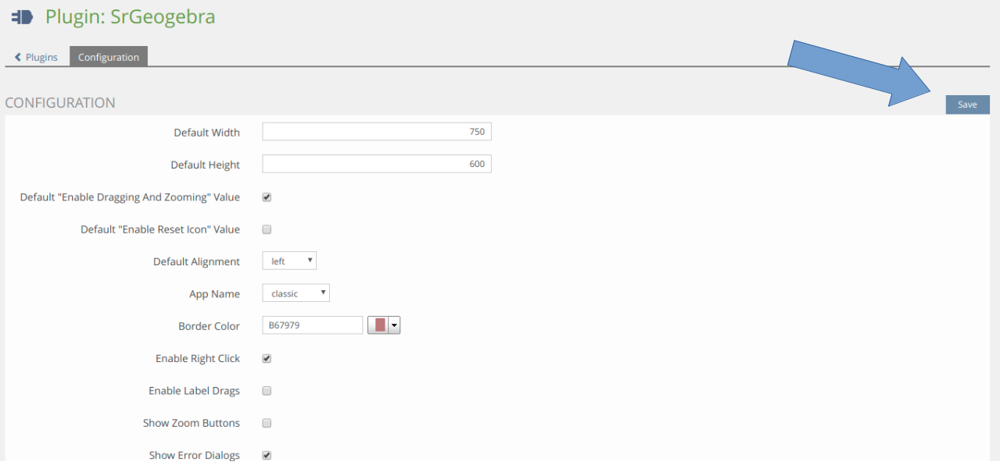

## SrGeogebra-Documentation

### Overview

SrGeogebra is an ILIAS Plugin used to display GeoGebra (.ggb) files inside the ILIAS page editor. The ILIAS page editor is the editor used in Wikis, ILIAS learning modules or if you "Customize Pages" of courses or groups.

https://www.geogebra.org/

> This documentation will teach you how to use the SrGeoGebra plugin within ILIAS learning modules.

### Usage

* Create SrGeoGebra objects
* Upload .ggb files
* Display .ggb files
* Edit SrGeoGebra objects
* Delete SrGeoGebra objects
* Set default values of new SrGeoGebra objects

#### Create SrGeoGebra objects

A user is able to create a new SrGeoGebra object by clicking the button "Click here to add content" and selecting the menu entry "Insert GeoGebra Object".

The user must now fill out all the form inputs correctly to successfully create a new SrGeoGebra object. The following inputs are presented to the user:

* __Title:__ The title this object should have. (Not displayed anywhere)
* __Upload:__ The .ggb file this object should display.
* __Width:__ The width this object should have. (In Pixels, e.g. 800)
* __Height:__ The height this object should have. (In Pixels, e.g. 600)
* __Enable Dragging And Zooming:__ States whether the Graphics View(s) should be moveable using Shift + mouse drag (or. Ctrl + mouse drag) or zoomable using Shift + mouse wheel (or Ctrl + mouse wheel). Setting this parameter to "false" disables moving and zooming of the drawing pad.
* __Enable Reset Icon:__ States whether a small icon (GeoGebra ellipse) should be shown in the upper right corner of the applet. Clicking on this icon resets the applet (i.e. it reloads the file given in the filename parameter).
* __Alignment:__ The side this object should be aligned to.

> Hint: The settings above are all considered "generic" settings. To keep creation simple, all "advanced" options are automatically taken from the plugin configuration. 

Finally, the user must click the button "Create" to save all inputs. The object has now been created.

#### Edit generic settings of SrGeoGebra objects

A user is able to edit the generic settings of a SrGeoGebra object by clicking onto an existing SrGeoGebra object and selecting the menu entry "Edit".

The user is now able to edit the generic settings by changing the values of the inputs as desired and clicking the button "Save". The object has now been edited.

#### Edit advanced settings of SrGeoGebra objects

A user is able to edit the advanced settings of a SrGeoGebra object by clicking onto an existing SrGeoGebra object and selecting the menu entry "Edit".

The user must now select "Advanced Settings" at the top.

The user is now able to edit the advanced settings by changing the values of the inputs as desired and clicking the button "Save". The object has now been edited. The user may now use the "< Page" button to return back to the edit page.

#### Delete SrGeoGebra objects

A user is able to delete a SrGeoGebra object by clicking onto an existing SrGeoGebra object and selecting the menu entry "Delete".

The user must accept the prompt by selecting "OK". The object has now been deleted.

#### Edit default settings

##### Note

Default settings are values that are automatically used in place of undefined values. The 5 top inputs starting with "Default" within the configuration are generic settings while all the other inputs are advanced settings. When creating a new SrGeoGebra object, the top 5 inputs are merely used as a template for new objects and can be edited. As all the other inputs are advanced settings that can't be defined when creating a new SrGeoGebra object, the values defined in here will automatically transfer onto newly created objects.

> All advanced settings used in this plugin are listed here: https://wiki.geogebra.org/en/Reference:GeoGebra_App_Parameters

##### Usage

An administrator is able to edit the default settings by accessing the plugin configuration under __Administration -> Plugins -> Actions/Configure__.

The administrator is now able to edit the default settings by changing the values of the inputs as desired and clicking the button "Save". The default settings have now been set.

### Hints

* Scaled objects are always forced to be aligned to the left
